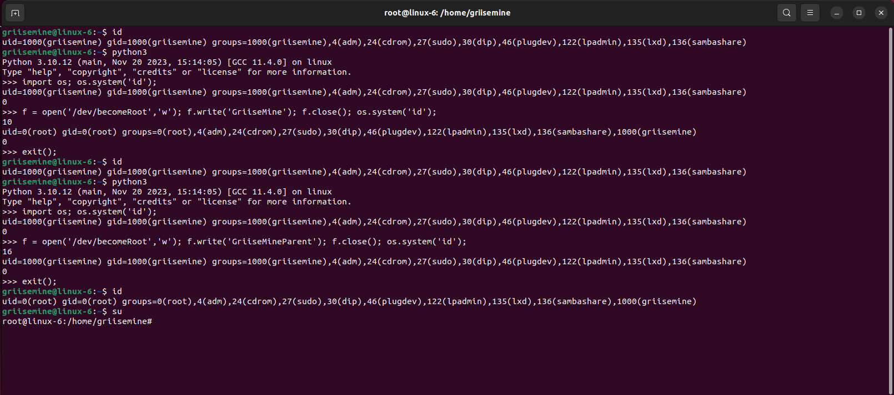

# Kernel Module Rootkit

J'ai concu un module kernel qui a la capacité de modifier les privilèges d'un processus ou de son processus parent lorsque une séquence de caractères définie est saisie. En dehors de cette condition spécifique, le module se limite à copier les informations saisies dans une variable nommée DATA. Ces données peuvent ensuite être récupérées par une opération de lecture sur le périphérique concerné.

## Objectif

L'objectif de ce projet est d'apprendre davantage sur le fonctionnement d'un noyau Linux, et notamment de son aspect sécurité. En créant un module kernel qui peut modifier les identifiants d'un processus, j'ai pu mieux comprendre le fonctionnement des systèmes de fichiers, la couche d'abstraction qui se cache derrière les fonctions `read` et `write`, la structure `task_struct` ainsi que son élément `creds` qui permet de définir l'utilisateur actuel d'une tâche, et la différence entre un programme userland et kerneland.

## Fonctionnement

Le module kernel crée un périphérique nommé `/dev/rootkit` qui peut être lu ou écrit par n'importe quel utilisateur. Lorsqu'un utilisateur écrit quelque chose sur ce périphérique, le module vérifie si le contenu correspond à l'un des deux mots de passe secrets : "GriiseMine" ou "GriiseMineParent". Si c'est le cas, le module change les credentials du processus appelant ou de son parent, respectivement, pour les faire passer en root. Sinon, le module stocke les données écrites dans une variable globale `DATA`. Lorsqu'un utilisateur lit le périphérique, le module lui renvoie le contenu de `DATA`.

## Fonctions techniques

Le module kernel implémente les fonctions suivantes :

- `becomeRoot_w_password` : Cette fonction est utilisée comme méthode `write` du périphérique. Elle lit un mot de passe de l'espace utilisateur, le compare avec des valeurs prédéfinies, et change les privilèges du processus en conséquence. Si le mot de passe correspond à "GriiseMine", le processus courant devient root. Si le mot de passe correspond à "GriiseMineParent", le parent du processus courant devient root. Sinon, les données reçues sont stockées dans une variable globale `DATA`.
- `read` : Cette fonction est utilisée comme méthode `read` du périphérique. Elle lit des données à partir d'un buffer global `DATA` et les copie dans le buffer de l'espace utilisateur fourni. La lecture prend en compte la position actuelle dans le fichier (indiquée par `loff_t *off`) et met à jour cette position après la lecture. La fonction limite la quantité de données lues à un maximum de 256 caractères à la fois. Si la position de lecture dépasse la longueur des données disponibles, la fonction retourne 0, indiquant la fin du fichier.
- `becomeRoot` : Cette fonction crée une nouvelle structure `cred` et définit tous les identifiants (UID, GID, EUID, EGID, etc.) à 0, ce qui correspond à l'utilisateur root. Elle appelle ensuite la fonction `commit_creds_to_specific_target` pour appliquer les nouveaux identifiants au processus cible, qui peut être le processus courant ou son parent.
- `commit_creds_to_specific_target` : Cette fonction est une adaptation de `commit_creds` du noyau Linux, mais permet de spécifier une tâche cible au lieu d'appliquer les credentials à la tâche courante.

## Détails techniques

Dans cette section, je vais expliquer plus en détail certains concepts et structures utilisés dans le projet, pour aider à mieux comprendre le fonctionnement du module kernel.

### La structure `task_struct`

La structure `task_struct` est une structure définie dans le fichier `include/linux/sched.h` du noyau Linux. Elle contient toutes les informations relatives à une tâche (un processus ou un thread) en cours d'exécution sur le système. Elle contient notamment :

- Les identifiants du processus : `pid`, `tgid`, `ppid`, etc.
- Les identifiants de l'utilisateur : `uid`, `gid`, `euid`, `egid`, etc.
- Les pointeurs vers les processus parent, enfant et frère : `real_parent`, `parent`, `children`, `sibling`, etc.
- Les pointeurs vers les structures `files_struct`, `fs_struct` et `nsproxy` qui gèrent les fichiers, les systèmes de fichiers et les namespaces du processus.
- Les pointeurs vers les structures `mm_struct` et `active_mm` qui gèrent la mémoire virtuelle et physique du processus.
- Les pointeurs vers les structures `signal_struct` et `sighand_struct` qui gèrent les signaux envoyés au processus.
- Les pointeurs vers les structures `cred` et `real_cred` qui contiennent les credentials du processus.

La structure `task_struct` est donc essentielle pour manipuler les processus et leurs attributs. Elle peut être accédée par le pointeur global `current` qui pointe vers la tâche courante, ou par des fonctions comme `find_task_by_pid` ou `find_task_by_vpid` qui prennent un identifiant de processus en paramètre et renvoient un pointeur vers la structure `task_struct` correspondante.

### La structure `cred`

La structure `cred` est une structure définie dans le fichier `include/linux/cred.h` du noyau Linux. Elle contient les informations d'identification d'un processus, telles que son UID, son GID, son EUID, son EGID, etc. Elle contient également d'autres informations liées à la sécurité, comme le SELinux context, le seccomp mode, ou le keyring. La structure `cred` est référencée par la structure `task_struct` à travers les pointeurs `real_cred` et `cred`.

La structure `cred` est conçue pour être immuable, c'est-à-dire qu'une fois créée, elle ne peut pas être modifiée. Pour changer les credentials d'un processus, il faut créer une nouvelle structure `cred`, la remplir avec les nouvelles valeurs, et la substituer à l'ancienne. Cela permet d'éviter les problèmes de concurrence ou de cohérence entre les différentes tâches qui partagent les mêmes credentials.

La fonction `commit_creds` du noyau Linux permet de remplacer les credentials d'un processus par une nouvelle structure `cred`. Elle s'occupe également de libérer l'ancienne structure `cred` et de mettre à jour les références dans la structure `task_struct`. La fonction `prepare_creds` permet de créer une copie des credentials actuels du processus, qui peut ensuite être modifiée avant d'être passée à `commit_creds`.

### La fonction `commit_creds`

La fonction `commit_creds` est une fonction définie dans le fichier `kernel/cred.c` du noyau Linux. Elle prend en paramètre un pointeur vers une structure `cred` et l'applique à la tâche courante. Elle effectue les opérations suivantes :

- Elle vérifie que la structure `cred` est valide et qu'elle n'est pas déjà utilisée par une autre tâche.
- Elle met à jour les pointeurs `cred` et `real_cred` de la structure `task_struct` de la tâche courante avec la nouvelle structure `cred`.
- Elle met à jour les pointeurs `cred` et `real_cred` de la structure `signal_struct` de la tâche courante avec la nouvelle structure `cred`.
- Elle met à jour les pointeurs `cred` et `real_cred` de la structure `sighand_struct` de la tâche courante avec la nouvelle structure `cred`.
- Elle met à jour les pointeurs `cred` et `real_cred` de la structure `request_key_auth` de la tâche courante avec la nouvelle structure `cred`.
- Elle appelle la fonction `security_commit_creds` qui permet au module de sécurité chargé de mettre à jour les informations de sécurité de la tâche courante avec la nouvelle structure `cred`.
- Elle appelle la fonction `selinux_update_inode` qui permet de mettre à jour les attributs SELinux de l'inode associé au processus courant avec la nouvelle structure `cred`.
- Elle appelle la fonction `proc_id_connector` qui permet de notifier le changement de credentials aux processus qui s'y sont abonnés.

La fonction `commit_creds` est donc essentielle pour changer les credentials d'un processus. Elle est utilisée par de nombreuses fonctions du noyau, comme `setuid`, `setgid`, `execve`, `fork`, etc.

### La fonction `commit_creds_to_specific_target`

La fonction `commit_creds_to_specific_target` est une fonction que j'ai créée pour adapter la fonction `commit_creds` du noyau Linux, mais en permettant de spécifier une tâche cible au lieu d'appliquer les credentials à la tâche courante.

## Conclusion

Ce projet m'a permis d'acquérir une compréhension approfondie du fonctionnement interne du noyau Linux, en particulier en ce qui concerne la gestion des processus et des privilèges. Bien que le module kernel développé dans ce projet puisse être utilisé pour des activités malveillantes, il est important de noter que l'objectif principal de ce projet est éducatif. J'espère que ce projet aidera d'autres personnes à comprendre le fonctionnement du noyau Linux et à développer leurs propres modules kernel.

## Disclaimer

Ce projet est destiné à des fins éducatives uniquement. L'utilisation de ce module kernel pour des activités malveillantes est strictement interdite. L'auteur de ce projet ne peut être tenu responsable de toute utilisation abusive de ce module kernel. L'installation et l'exécution de ce module kernel peuvent entraîner des dommages irréversibles au système ou à la sécurité. Utilisez ce module kernel à vos propres risques.
